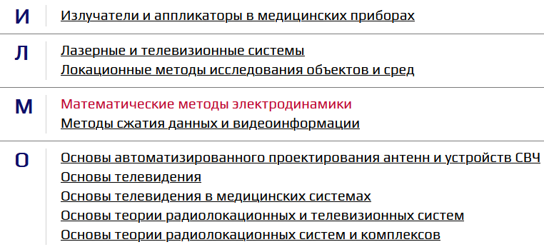

# UI-компонент алфавитного списка

## Table of contests

- [Входные данные](#входные-данные)
- [Как выглядит](#как-выглядит)

## Входные данные

Объект формата:

```javascript
{
  "group_name": [
    // может быть несколько
    {
      NAME: "имя",
      LINK: "ссылка",
    },
    {
      NAME: "имя_другое",
      LINK: "ссылка_другая",
    },
  ],
  "group_name_2": [
    {
      NAME: "имя",
      LINK: "ссылка",
    },
  ],
}
```

## Как выглядит


